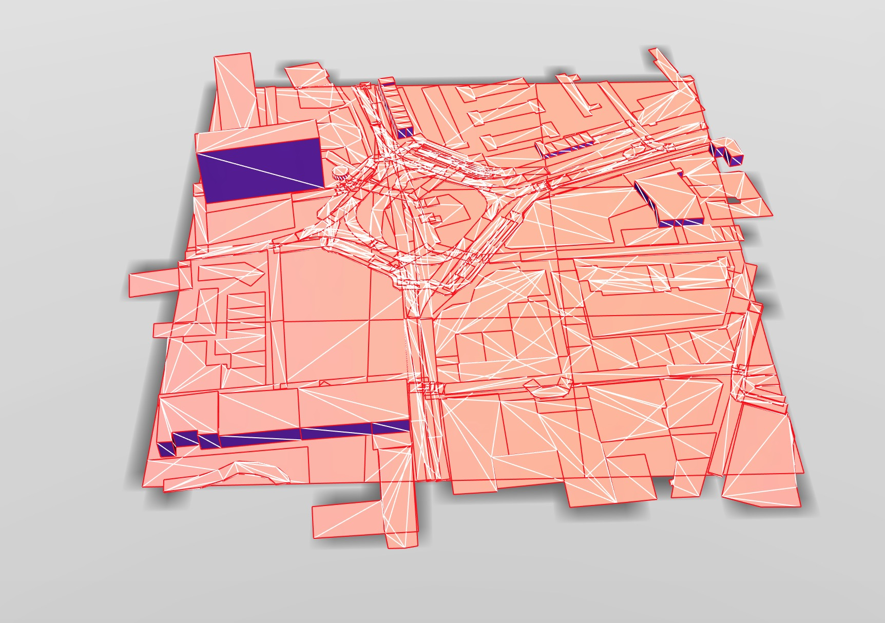

# var-bartlett-point-cloud


# Contact

marcin@variable.io

# Days

[Day 02](Day02.md)


# MapBox API

https://api.mapbox.com/v4/mapbox.streets/Z/X/Y.png?access_token=ACCESS_TOKEN

https://www.openstreetmap.org/#map=18/51.52561/-0.08748

https://www.mapbox.com/api-documentation/#maps

e.g. For Old Steet https://api.mapbox.com/v4/mapbox.streets/18/131008/87148.png?access_token=TOKEN


OSM conversion code https://wiki.openstreetmap.org/wiki/Slippy_map_tilenames#Lon..2Flat._to_tile_numbers


3d model map export via [vectiler](https://github.com/karimnaaji/vectiler) rendered in [Vectary](https://www.vectary.com/engine/)

```bash
./vectiler.out --tilex 131007/131009 --tiley 87147/87149 --tilez 18 --roads 1
```




# Unity

Primitive Plane is 10x10 by default

# Point Cloud Software

http://www.faro.com/en-us/products/faro-software/scene/features#main

# Other Notes

Poisson Disk Sampling
http://devmag.org.za/2009/05/03/poisson-disk-sampling/
http://theinstructionlimit.com/wp-content/uploads/2009/07/UniformPoissonDiskSampler.cs
http://www.cs.ubc.ca/~rbridson/docs/bridson-siggraph07-poissondisk.pdf

