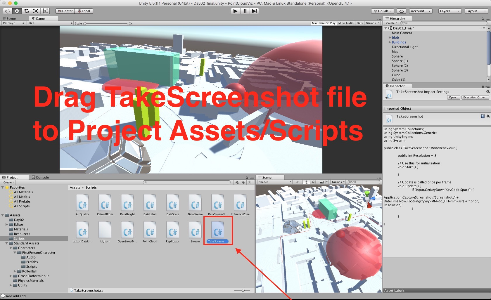

## Taking screenshots

This guide explains how to save screenshots from Unity at resolution of 10k+ pixels.

### 1.
Download/Save As file
 [TakeScreenshot.cs](https://raw.githubusercontent.com/variablestudio/var-bartlett-point-cloud/master/unity/PointCloudViz/Assets/Scripts/TakeScreenshot.cs) and drag it to the Project Assets / Scripts.

### 2.
Open Edit menu -> Project Settings -> Quality

### 3.
Disable Anti Aliasing

### 4.
Drag TakeScreenshot script onto the Main Camera. Disable FPSCamera if you have one.

### 5.
Start game by clicking Play button and now at any time you can press `[Space]` to save screenshot.

### 6.
The screenshot should appear in the project folder with with a current time and date.

